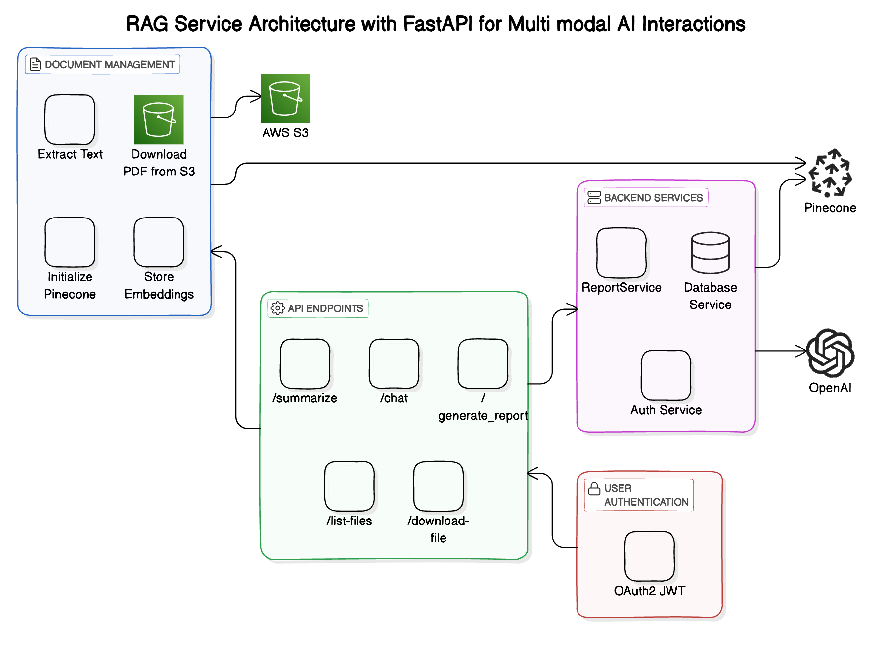

# Assignment 3 - MultiModal Rag Application

## Project Links and Resources

- **GitHub Issues and Tasks**: [Link to GitHub Project Issues](https://github.com/orgs/DAMG7245-Big-Data-Sys-SEC-02-Fall24/projects/5/views/1)
- **Codelabs Documentation**: [Link to Codelabs](https://codelabs-preview.appspot.com/?file_id=1-QWsYzlHKrLpZkAiQ0VeiFPaY5uey8HvwCgqSWxd244#0)
- **Project Submission Video (5 Minutes)**: [Link to Submission Video](https://drive.google.com/drive/folders/1wgYeUY-HsDuWcqGq1hSNVRQ3gvQBMLZC)
- **Hosted Application Links**:
  - **Frontend (Streamlit)**: [Link to Streamlit Application](http://35.185.111.184:8501)
  - **Backend (FastAPI)**: [Link to FastAPI Application](http://35.185.111.184:8000/docs)
  - **Data Processing Service (Airflow)**: [Link to Data Processing Service](http://35.185.111.184:8080)
---

## Introduction

This project focuses on establishing a comprehensive multimodal Retrieval-Augmented Generation (RAG) pipeline, specifically for extracting, storing, and processing financial documents from the CFA Institute Research Foundation. The system is designed to efficiently handle various document formats and create a streamlined experience for querying and summarizing documents.

### Key Technologies:

- **Llama Parse Framework** for initial data extraction and parsing.
- **PyMuPDF** for PDF text extraction in the QA and summarization API.
- **FastAPI** for backend processing, including JWT-based authentication and API handling.
- **Streamlit** for frontend interface enabling user interaction with processed data.
- **Apache Airflow** for automating data ingestion and orchestration.
- **AWS S3** for storing scraped images and PDFs.
- **Snowflake** for database management and indexing extracted document data.
- **MongoDB** for storing extracted data from the PDF documents.
- **PostgreSQL** for managing user credentials securely.

The project also utilizes JWT tokens for secure API endpoint interactions, supporting access and refresh tokens for effective session management.

## Problem Statement

The project's primary objective is to develop an automated pipeline to ingest, process, and interact with financial research documents. Users are provided with a secure platform that allows efficient querying and summarization of documents, leveraging advanced processing tools and natural language models to facilitate interactive document exploration.

### Key Objectives

1. **Automated Data Ingestion**: Efficiently scrape document data, including images, text, and PDFs, and store it in a structured format.
2. **Streamlined Query and Summarization**: Provide advanced querying and summarization using OpenAI models and multimodal RAG capabilities.
3. **Secure User Management**: Ensure robust access management with JWT-based authentication.
4. **Scalable Infrastructure**: Enable cloud-based deployment to handle extensive datasets and multiple document types.
   

### Part 1: Data Ingestion and Database Population

- **Airflow Orchestration**: Set up automated pipelines in Airflow for scraping and processing publication data.
- **Data Storage**: Store extracted data in AWS S3, ensuring secure access and retrieval from Snowflake for database indexing and organization.

### Part 2: Client-Facing Application Development

### Backend (FastAPI)

##### User Authentication:
  - Implement JWT-based login and registration.
  - Require JWT bearer tokens for all endpoints.
  - Implement access and refresh token mechanisms for session management.
  

#### Cloud Architecture for a RAG (Retrieve-Augment-Generate) Service Handling PDF Documents

This architecture outlines a service that processes PDF files, stores their embeddings, and facilitates AI-driven chat interactions based on the content of these PDFs. The system leverages AWS for storage, Pinecone for vector database management, and OpenAI for language model capabilities.

**Components**

1. Document Ingestion and Processing
    1. **Download PDF from S3**  
       - Retrieve PDF documents stored in Amazon S3 using the `download_pdf_from_s3` utility.

    2. **Extract Text from PDF**  
        - Utilize `get_pdf_documents` to parse and extract textual content from the downloaded PDF files.

2. **Embedding and Storage**
    1. **Initialize Pinecone**  
        - Set up the Pinecone environment using the `initialize_pinecone` function.

    2. **Generate Embeddings**  
        - Create vector embeddings of the extracted text using the `embed_model` (OpenAI or NVIDIA embeddings).

    3. **Store Embeddings in Pinecone**  
        - Organize and store the generated embeddings in a Pinecone index (`PINECONE_INDEX_NAME`) to enable efficient similarity searches.

    4. **Manage Stored Pages**  
        - Use `load_stored_pages` to ensure that duplicate pages are not reprocessed and stored.

3. **Vector Database Management**
    1. **Setup Pinecone Index**  
        - Configure the Pinecone index with the specified vector dimension (`VECTOR_DIMENSION`) to maintain consistency across embeddings.

    2. **Store Text Chunks**  
        - Save the processed text chunks along with their metadata (e.g., page numbers, source PDF) in Pinecone for future retrieval.

4. **User Interaction and Query Handling**
    1. **Initialize RAG Setup**  
        - Ensure that the document embeddings are initialized and stored in Pinecone by invoking `initialize_rag` with the relevant `document_id`.

    2. **Generate Query Embedding**  
        - Convert the user’s chat message into a vector embedding using the `embed_model`.

    3. **Query Pinecone**  
        - Perform a similarity search in Pinecone using the query embedding to retrieve the top relevant text chunks (`SIMILARITY_TOP_K`).

    4. **Aggregate Relevant Text**  
        - Compile the retrieved text segments to form the context for generating a response.

5. **Response Generation**
    1. **Interact with LLM**  
        - Utilize OpenAI’s language model (OpenAI) to generate a detailed, Markdown-formatted response based on the aggregated relevant text and the user’s original query.

    2. **Return Response to User**  
        - Deliver the generated response back to the user through the chat interface.

6. **Error Handling and Logging**
    1. **Exception Management**  
        - Implement robust error handling using FastAPI’s `HTTPException` to manage issues like missing documents, embedding failures, or Pinecone query errors.

    2. **Logging**  
        - Maintain logs for operations such as document summarization and query processing to facilitate monitoring and debugging.

**Workflow Summary**

1. **Initialization**
    - User uploads a PDF to S3.
    - Service downloads the PDF and extracts its text content.
    - Text is embedded into vectors and stored in Pinecone.

2. **Chat Interaction:**
    - User sends a query related to the PDF content.
    - Query is embedded and used to search Pinecone for similar vectors.
    - Relevant text chunks are retrieved and aggregated.
    - OpenAI’s LLM generates a response based on the aggregated text and the user’s query.
    - The response is returned to the user.

This architecture ensures efficient processing, storage, and retrieval of document content, enabling seamless and intelligent AI-driven interactions based on the uploaded PDF files.

### A high level diagram for the backend
  


#### Frontend (Streamlit)

- **User Interaction**:
  - Provide a streamlined interface for user registration and login.
  - Enable document querying and summarization through interactive options.
  - Display selected PDF extracts with query-specific information.

### Deployment

- **Dockerized Deployment**:
  - Use Docker Compose to deploy the backend (FastAPI) and frontend (Streamlit) on GCP, with Docker images compatible with both ARM and AMD architectures.
  - Ensure `.env` and `secrets` directories are properly configured for deployment.


## Local Setup and Running the Project Locally

### Prerequisites

Ensure the following tools are installed on your system:

- **Python 3.12**
- **Poetry** for dependency management
- **Docker** and **Docker Compose**
- **Git** for repository management

### Clone the Repository

Clone the repository to your local machine:

```
git clone https://github.com/DAMG7245-Big-Data-Sys-SEC-02-Fall24/Assignment2_team1.git
cd Assignment2_team1
```


### Run the docker file

- Navigate to the docker file:
```
docker-compose up -d
```

## Project Directory Structure

Here is the complete directory structure of the project:

```
(base) udaykiran@Udays-MacBook-Pro Assignment_3_Team1 % tree 
.
├── README.md
├── airflow
│   ├── Dockerfile
│   ├── dags
│   │   ├── publications_data.csv
│   │   ├── scraper_dag.py
│   │   └── scripts
│   │       ├── __init__.py
│   │       ├── aws_s3.py
│   │       ├── scraper.py
│   │       └── snowflake_utils.py
│   ├── docker-compose.yaml
│   ├── plugins
│   ├── readme.md
│   ├── requirements.txt
│   └── variables.json
├── airflow_var
│   ├── Dockerfile
│   ├── dags
│   │   ├── publications_data.csv
│   │   ├── scraper_dag.py
│   │   └── scripts
│   │       ├── __init__.py
│   │       ├── aws_s3.py
│   │       ├── scraper.py
│   │       └── snowflake_utils.py
│   ├── docker-compose.yaml
│   ├── plugins
│   ├── readme.md
│   ├── requirements.txt
│   └── variables.json
├── assets
│   ├── A3_architecture diagram.jpeg
│   └── Backend API.jpeg
├── backend
│   ├── Dockerfile
│   ├── __init__.py
│   ├── app
│   │   ├── __init__.py
│   │   ├── config
│   │   │   └── settings.py
│   │   ├── controllers
│   │   │   ├── __init__.py
│   │   │   └── auth_controller.py
│   │   ├── main.py
│   │   ├── models
│   │   │   ├── __init__.py
│   │   │   ├── publication.py
│   │   │   └── user_model.py
│   │   ├── routes
│   │   │   ├── auth_routes.py
│   │   │   ├── publications_routes.py
│   │   │   ├── rag.py
│   │   │   └── summary_routes.py
│   │   └── services
│   │       ├── PublicationService.py
│   │       ├── __init__.py
│   │       ├── auth_service.py
│   │       ├── database_service.py
│   │       ├── document_service.py
│   │       ├── gpt.py
│   │       ├── mongo.py
│   │       ├── object_store.py
│   │       ├── snowflake.py
│   │       ├── table_page_1_1.csv
│   │       └── tools.py
│   ├── multimodal_report_generation.ipynb
│   ├── poetry.lock
│   ├── pyproject.toml
│   └── secrets
│       ├── gcp.json
│       ├── private_key.pem
│       └── public_key.pem
├── docker-compose.yaml
├── env
├── frontend
│   ├── Dockerfile
│   ├── app.py
│   ├── app_pages
│   │   ├── __init__.py
│   │   ├── document_actions_page.py
│   │   ├── documents_page.py
│   │   ├── home_page.py
│   │   └── pdf_gallery.py
│   ├── components
│   │   ├── __init__.py
│   │   ├── navbar.py
│   │   ├── services
│   │   │   ├── __init__.py
│   │   │   ├── pdf_viewer.py
│   │   │   └── s3_service.py
│   │   └── ui
│   │       ├── __init__.py
│   │       ├── buttons.py
│   │       └── card.py
│   ├── poetry.lock
│   ├── pyproject.toml
│   ├── services
│   │   ├── authentication.py
│   │   ├── pdf_viewer.py
│   │   ├── session_store.py
│   │   └── utils.py
│   └── styles
│       └── styles.css
├── infra
│   ├── provider.tf
│   └── s3.tf
├── prototyping
│   └── __init__.py
├── scripts
│   └── __init__.py
├── secrets
│   ├── gcp.json
│   ├── private_key.pem
│   └── public_key.pem
└── sql
    └── schema.sql

```

## Architecture Diagram


### Description of Components:
- **Airflow**: Orchestrates the ETL pipeline from data extraction to storage. 
- **FastAPI**: Serving as the web framework to handle API requests and responses.
- **Streamlit**: The client-facing frontend where users can select documents, view documents, summarize them, or query specific content and also view the report for that specific document.
- **PostgreSQL**: Stores user information for authentication.
- **GCP (Google Cloud Platform)**: Provides the infrastructure for the entire platform, including storage (GCS) and VM instances for deployment.
- **AWS S3**: Holds extracted document images and PDFs.
- **Snowflake**: Support fast document metadata retrieval and search.
- **Pinecone**: As the vector database for storing and querying embeddings.
- **OpenAI**: For generating embeddings and processing natural language responses.
- **NVIDIA Embedding API (Optional)**: As an alternative for generating vector embeddings.

### Data Flow:
1. For each and every publication, title summary and image PDFs are uploaded to GCP storage.
2. The upload S3 URLs along with other content are stored in snowflake.
3. Those relevant documents are used in the backend for summarying, querying and report generation using different LLM services and vector stores.
4. Users interact with the data through the Streamlit frontend, querying and summarizing the documents.


**Team Members:**
- Uday Kiran Dasari - Airflow, Backend ,Docker - 33.3%
- Sai Surya Madhav Rebbapragada - Backend, Integratrion - 33.3%
- Akash Varun Pennamaraju - Airflow, Infra setup,Backend, Integration - 33.3%


## References

- [FastAPI Documentation](https://fastapi.tiangolo.com/)
- [Streamlit Documentation](https://docs.streamlit.io/)
- [Airflow Documentation](https://airflow.apache.org/docs/)
- [Selenium (Web Scraping)](https://www.selenium.dev/documentation/)
- [Snowflake](https://docs.snowflake.com/)
- [Docker](https://docs.docker.com/)
- [OpenAI GPT API](https://platform.openai.com/docs/)
- [LlamaIndex](https://docs.llamaindex.ai/en/stable/)
- [PyMuPDF](https://pymupdf.readthedocs.io/en/latest/)
- [Google Cloud Storage](https://cloud.google.com/storage/docs/)


